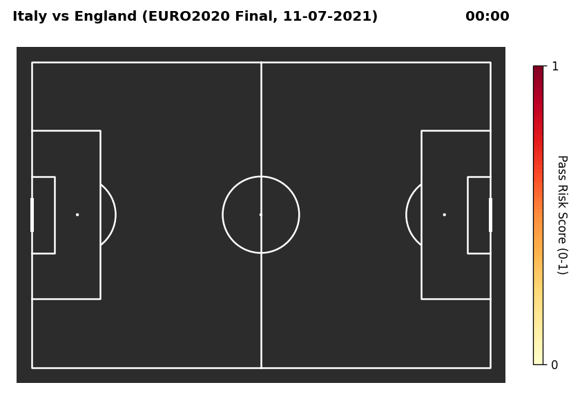

# Pass Risk Quantification Metric
Pass quality assessment for champion Italy national team in Euro 2020 competition.

## Scripts
- **download_italy_euro2020_data.py**  
  Utility script to download all available information from the [StatsBomb open-data repository](https://github.com/statsbomb/open-data) related to Italy’s matches in Euro 2020 competition.

  Files are saved under `data/italy_euro2020` directory, maintaining original StatsBomb repository structure.

## Data Sources
This project uses data provided by [StatsBomb](https://statsbomb.com).

Please refer to their [Open Data License](https://github.com/statsbomb/open-data/blob/master/LICENSE.md) for terms. 
